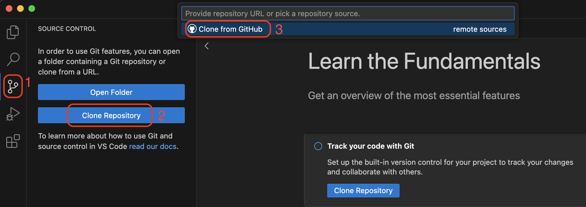
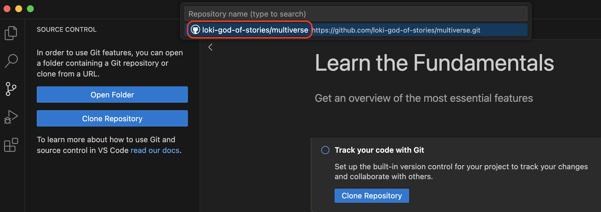
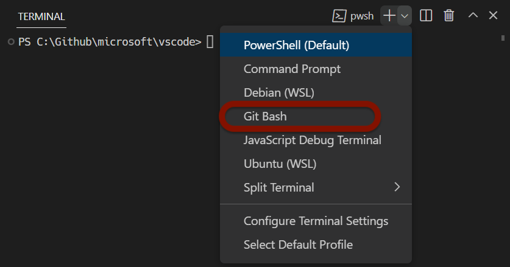
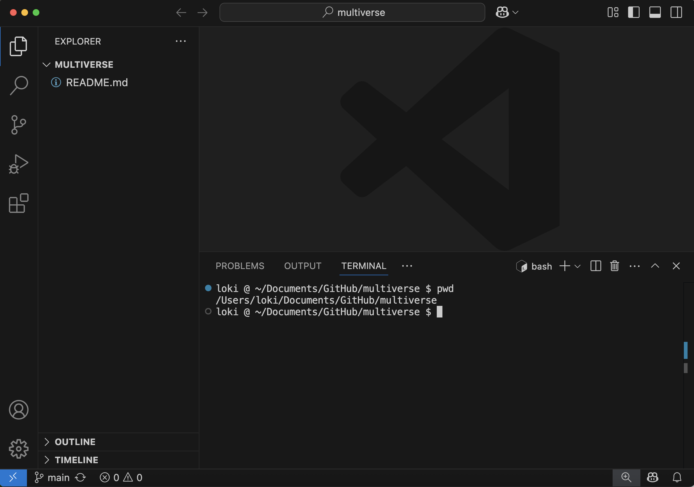

:::::::::::::::::::::::::::::::::::::: questions 

- How do I create a new repository on GitHub?
- How do I clone the repository to my local computer?

::::::::::::::::::::::::::::::::::::::::::::::::

::::::::::::::::::::::::::::::::::::: objectives

- Create `multiverse` repository on GitHub
- Clone the `multiverse` repository using VS Code

::::::::::::::::::::::::::::::::::::::::::::::::

:::::::::::::::::::::::::::::::::::::::::::::::::::::::::::::::::::: instructor

When the workshop begins, you should be sharing your screen,
and instruct the learners to make sure their setup looks like yours:

1. A new VS Code window is open (taking up the left 75% of the screen)
2. A browser window with GitHub is open (taking up the right 75% of the screen)

In your browser window, you can have a second tab open with all images for
this workshop, available at [this URL](http://jennajordan.me/git-novice-speedrun/instructor/images.html)

::::::::::::::::::::::::::::::::::::::::::::::::::::::::::::::::::::::::::::::::

## Create a new repo on GitHub

The first thing we need to do is create a new repository. While you can create repositories locally, and never even connect the local repo to a remote repo (hosted on a site like GitHub), the simplist and most common pattern to first create a new repo on GitHub, and then clone that repo to your local computer.

:::::::::::::::::::::::::::::::::::::::::::::::::::::::::::::::::::: instructor

The documentation for creating a new repo on GitHub is available [here](https://docs.github.com/en/repositories/creating-and-managing-repositories/creating-a-new-repository)

If you have taught this lesson before, make sure that you have deleted your existing `multiverse` repo.
The documentation for deleting a repo on GitHub is available [here](https://docs.github.com/en/repositories/creating-and-managing-repositories/deleting-a-repository)

::::::::::::::::::::::::::::::::::::::::::::::::::::::::::::::::::::

You should already be signed in to GitHub. You can create a new repo from anywhere on the site by clicking on the "+" icon in the upper right, and then clicking "New Repository":

Select your Github username as the "owner". 

Type `multiverse` for the repository name. 

Check the box next to "Add a README file".

Leave all other options as the default - your repo should be public, no gitignore selected, no license selected, and no template selected.

Finally, click the green "Create Repository" button at the bottom right.

You will be redirected to your newly created and empty `multiverse` repo.

## Clone your multiverse repo to your local computer

Now that the `multiverse` repo has been created, we can "clone" it (get a local copy of the repo) through VS Code.

Make sure you have a new VS Code window open. If you already have a repo/folder open in VS Code, go to the "File" menu and click "New window".

In your new VS Code window, go to the "Source Control" pane (the 3rd one down). Click "Clone Repository", and then click "Clone from GitHub".

If you don't immediately see your `multiverse` repo, you can search for it by typing "multiverse" in the search box. When you see your `multiverse` repo (it should have your username in the URL), click it.

You will now need to choose where on your local computer the `multiverse` repo will live. You can choose any easily accessible location, such as the "Desktop" folder. It is standard practice to save all local repos in a folder named "GitHub" in your "Documents" folder.

Click "Open" when prompted to open the newly cloned `multiverse` repo.

## Open a Bash Terminal in VS Code

Now that you have your `multiverse` repo cloned and open in VS Code, the last step is to open a bash terminal.

To see the terminal pane, go to the "Terminal" menu, and click "New terminal".

If you are on a Windows computer, you will need to specifically open a GitBash terminal. Find the "+" icon in the terminal pane, and click the carrot dropdown icon next to it. Click "GitBash".

If you are on a Mac or Linux computer, your default terminal should be sufficient. You can also choose to open a Bash terminal by following the same instructions.

You should now have your empty `multiverse` repo open, with a Bash terminal open, and you are ready to start typing your first git commands!

:::::::::::::::::::::::::::::::::::::::: keypoints

- Create a new repository on GitHub
- Clone the repository to your local computer
- Open the terminal in VS Code

::::::::::::::::::::::::::::::::::::::::::::::::::